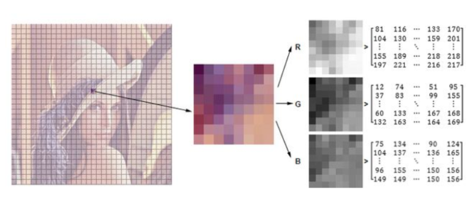

# opencv基本操作



## 图像IO

读取图片
`cv2.imread(filename[,flag])`

flag有三种取值：
* cv2.IMREAD_COLOR : 彩色图
* cv2.IMREAD_GRAYSCALE : 灰度图
* cv2.IMREAD_UNCHANGED : Loads image as such including alpha channel
* 可以用 1, 0 or -1 来代替这三个取值.
* imread读取的图像的类型是ndarray（w,h,c),单个元素的类型是uint8

保存图片
`cv2.write(filename,img[,params])`默认以PNG保存。

显示图片
`cv2.imshow(name,img)`

截取部分图片
`切片操作即可`

颜色通道切分
`b,g,r = cv2.split(img)`

颜色通道合并
`img=cv2.merge((b,g,r))`

隐藏部分图片通道
`img[:,:,0]=0`隐藏b通道

边界填充
`replicate = cv2.copyMakeBorder(img, top_size, bottom_size, left_size, right_size,type)`
* top_size,bottom_size,left_size,right_size为上下左右分别扩展的像素的个数
type有五种取值：
- BORDER_REPLICATE：复制法，也就是复制最边缘像素。
- BORDER_REFLECT：反射法，对感兴趣的图像中的像素在两边进行复制例如：fedcba|abcdefgh|hgfedcb   
- BORDER_REFLECT_101：反射法，也就是以最边缘像素为轴，对称，gfedcb|abcdefgh|gfedcba
- BORDER_WRAP：外包装法cdefgh|abcdefgh|abcdefg  
- BORDER_CONSTANT：常量法，常数值填充。

数值计算
* 读取的数值是numpy.ndarray类型，dytpe是'uint8'
* 可以直接对其直接进行加减运算，这里的运算对256取余

`cv2.add(img1,img2)`
* 注意两幅图片的大小类型必须一致，或者第二个图象是一个标量.
* opencv中加法是饱和操作，也就是有上限值，大于255的取255

图像尺度变化
`cv2.resize(img_dog, (w,h))`
* 处理之后的图像大小为(h,w,c)

图像融合
`res = cv2.addWeighted(img1,weight1,img2,weight2,gamma)`
* 注意，融合的两张图片的shape应该相同，采用`resize`函数而非`reshape`
* reshape:只是在逻辑上改变矩阵的行列数或者通道数，没有任何的数据的复制，也不会增减任何数据，因此这是一个O(1)的操作，它要求矩阵是连续的。
* resize:对图像进行压缩扩大处理，采用插值方法
* gamma：加到每个总和上的标量，相当于调亮度

用matplotlib显示opencv读取的图片

```python
def plt_show(img):
    # opencv读取的图片是BRG通道，matplotlib读取的图片是RGB通道
    cv_rgb = cv2.cvtColor(img,cv2.COLOR_BGR2RGB)
    plt.imshow(cv_rgb)
    plt.show()
```

## 视频IO

读取视频
`cv2.VideoCapture`
* 可以捕获摄像头，用数字来控制不同的设备，例如0,1。
* 如果是视频文件，直接指定好路径即可。

视频读取完整流程

```python
vc = cv2.VideoCapture('test.mp4')
# 检查是否打开正确
if vc.isOpened():
    open, frame = vc.read()
else:
    open = False
while open:
    ret, frame = vc.read()
    if frame is None:
        break
    if ret == True:
        gray = cv2.cvtColor(frame,  cv2.COLOR_BGR2GRAY)
        cv2.imshow('result', gray)
        if cv2.waitKey(100) & 0xFF == 27:
            break
vc.release()
cv2.destroyAllWindows()
```