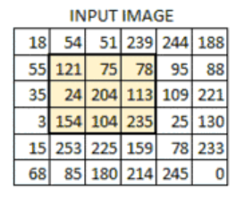

## 图像阈值

`ret, dst = cv2.threshold(src, thresh, maxval, type)`

- src： 输入图，只能输入单通道图像，通常来说为灰度图
- dst： 输出图
- thresh： 阈值
- maxval： 当像素值超过了阈值（或者小于阈值，根据type来决定），所赋予的值
- type：二值化操作的类型，包含以下5种类型：
  - cv2.THRESH_BINARY:超过阈值部分取maxval（最大值），否则取0
  - cv2.THRESH_BINARY_INV:THRESH_BINARY的反转
  - cv2.THRESH_TRUNC:大于阈值部分设为阈值，否则不变
  - cv2.THRESH_TOZERO:大于阈值部分不改变，否则设为0
  - cv2.THRESH_TOZERO_INV:THRESH_TOZERO的反转

## 图像平滑

它们都属于卷积，不同滤波方法之间只是卷积核不同。低通滤波器是模糊，高通滤波器是锐化。低通滤波器就是允许低频信号通过，在图像中边缘和噪点都相当于高频部分，所以低通滤波器用于去除噪点、平滑和模糊图像。高通滤波器则反之，用来增强图像边缘，进行锐化处理。

均值滤波
`blur = cv2.blur(img, (3, 3))`

方框滤波
`cv2.boxFilter(img,-1,(3,3), normalize=True)`
* 第二个参数是ddepth – the output image depth (-1 to use src.depth()).
* 当可选参数 normalize 为 True 的时候，方框滤波就是均值滤波。normalize 为 False 的时候，a=1，相当于求区域内的像素和。

高斯滤波
`cv2.GaussianBlur(src, ksize, sigmaX[, dst[, sigmaY[, borderType]]])`
* ksize可以选（3，3）等
* sigmaX – Gaussian kernel standard deviation in X direction.
* 高斯滤波后图像的平滑程度取决于标准差，sigmaX越大，模糊效果越明显。
* 高斯滤波相比均值滤波效率要慢，但可以有效消除高斯噪声，能保留更多的图像细节，所以经常被称为最有用的滤波器。
* 相对于均值滤波（mean filter）它的平滑效果更柔和，而且边缘保留的也更好

中值滤波
`cv2.medianBlur(img, 5)`
* 又叫中位数，是所有数排序后取中间的值。
* 中值滤波就是用区域内的中值来代替本像素值，所以那种孤立的斑点，如0或255很容易消除掉，适用于去除椒盐噪声和斑点噪声。
* 中值是一种非线性操作，效率相比前面几种线性滤波要慢。

双边滤波
`cv2.bilateralFilter(src, d, sigmaColor, sigmaSpace[, dst[, borderType]])`
* 模糊操作基本都会损失掉图像细节信息，尤其前面介绍的线性滤波器，图像的边缘信息很难保留下来。然而，边缘（edge）信息是图像中很重要的一个特征，所以这才有了双边滤波